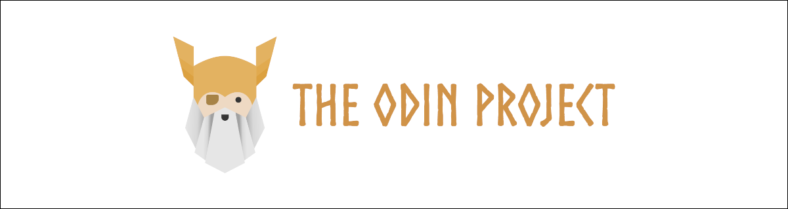

<h1 align="center">TOP-Rock-Paper-Scissors - Readme</h1>

  <strong>
    My solution for <a href="https://www.theodinproject.com/lessons/foundations-rock-paper-scissors" target="_blank">Project: Rock Paper Scissors</a> on  <a href="https://www.theodinproject.com/paths/foundations/courses/foundations" target="_blank">Foundations Course</a> from <a href="https://www.theodinproject.com" target="_blank">The Odin Project (TOP)</a>
  </strong>

  

 

# Table of Contents
* [The Odin Project :thinking:](#the-odin-project-thinking)
  * [What is it](#what-is-it)
  * [Is it worth doing](#is-it-worth-doing)
* [Overview :sparkles:](#overview-sparkles)
  * [About](#about)
  * [Features](#features)
  * [Technologies](#technologies)
  * [Setup](#setup)
* [Details :scroll:](#details-scroll)
  * [User interface](#user-interface)

 

# FrontendMentor :thinking:

## What is it  
[The Odin Project](https://www.theodinproject.com) is a free, open-source curriculum that teaches web development from the ground up. It covers HTML, CSS, JavaScript, Git, and back-end technologies like Node.js, offering a structured path from beginner to job-ready developer. The curriculum includes hands-on projects, coding exercises, and real-world applications to reinforce learning.  

## Is it worth doing  
The Odin Project is an excellent resource for self-taught developers looking for a structured and comprehensive learning path. It encourages active learning through projects and collaboration with the community. However, since it requires self-discipline and problem-solving skills, those who prefer guided instruction with direct mentorship might find it challenging.  

 

# Overview :sparkles:

## About
This project is my solution for [Project: Rock Paper Scissors](https://www.theodinproject.com/lessons/foundations-rock-paper-scissors) on [Foundations Course](https://www.theodinproject.com/paths/foundations/courses/foundations) from [The Odin Project (TOP)](https://www.theodinproject.com) which is an open-source curriculum for learning full-stack web development.

Check out the [live version](https://pasek108.github.io/TOP-Rock-Paper-Scissors/).

 

## Technologies
Languages:
- JavaScript
- HTML
- CSS

Libraries and frameworks:
- [Howler.js](https://howlerjs.com)
- [GoogleFonts](https://fonts.google.com)
  
Programs:
- [VSCode](https://code.visualstudio.com)
- [PowerToys](https://learn.microsoft.com/en-us/windows/powertoys/)
- [ShareX](https://getsharex.com)
- [GIMP](https://www.gimp.org)

## Features
### Project requirements
- ✅ Computer randomly picks "rock", "paper", or "scissors"
- ✅ Determine round winner and update score
- ✅ Play 5 rounds and declare a winner
- ✅ Track `humanScore` and `computerScore`
- ✅ Remove fixed 5-round logic
- ✅ Add buttons for Rock, Paper, Scissors with event listeners
- ✅ Display results using DOM manipulation
- ✅ Announce winner when a player reaches 5 points
- ✅ Deploy via GitHub Pages and add live preview link

### Additions
- Responsive layout  
- Visually appealing UI  
- Rock-paper-scissors represented as a frog fight  
- Smooth animations  
- Restart functionality  

 

> [!NOTE]  
> Room for improvements:
> - Buying frogs (max 6)
> - Frogs stats
> - Waiting for the frog to heal
> - Releasing frogs
> - Begging for money
> - Frog cemetery and freed frogs
> - Achievements
> - Saving state to localStorage

## Setup
- Use [live version](https://pasek108.github.io/TOP-Rock-Paper-Scissors/).

- Download this repository and:
  - Open project in VSCode
  - Run [VSCode live server extension](https://marketplace.visualstudio.com/items?itemName=ritwickdey.LiveServer)

## Acknowledgements
### Images
- [Arena background](https://miro.medium.com/v2/resize:fit:1400/format:webp/1*q5XOBaFd_ykWlnMqd1Es3w.gif)
- [Paper scroll banner](https://www.vecteezy.com/vector-art/49315197-8-bit-pixel-art-medieval-paper-scroll-parchment)
- [Frogs](https://eduardscarpato.itch.io/toxic-frog-animations-pixel-art-2d-free)
- [Border](https://gx310.itch.io/pxiel-art-ui-borders)
- [Rock icon](https://deepai.org/machine-learning-model/text2img)
- [Paper icon](https://deepai.org/machine-learning-model/text2img)
- [Scissors icon](https://deepai.org/machine-learning-model/text2img)
- [Grave image](https://deepai.org/machine-learning-model/text2img)

### Music and sounds
- [Background music](https://freesound.org/people/CarlosCarty/sounds/581364/)
- [Win fanfare](https://opengameart.org/content/win-fanfare)
- [Puff sound](https://pixabay.com/sound-effects/puffofsmoke-47176/)
- [Bell](https://scratch.mit.edu)
- [Croak](https://scratch.mit.edu)

 

# Details :scroll:

## User interface

### Pick Menu  
  
At the top, there is a menu with three options - rock, paper, and scissors, depicted as images. To play a round, the user must click on one of the options.  

---

### Frogs  
  
The game state is reflected by two frogs: the player’s frog on the left and the enemy frog on the right. Below them, a health bar represents their remaining health.  

---

### Attack  
  
When the user selects an option, the round is played, and the result is displayed. The losing pick is slashed, and the losing frog gets hit, losing an unit of health.  

---

### Winner  
  
If one of the frogs loses all its health, it disappears, and a win or lose message, along with music, is played.  

